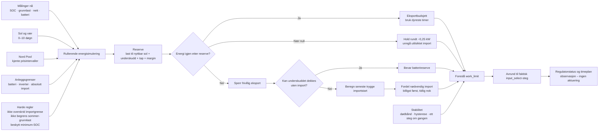

# Local Solar Forecast

This Home Assistant app replaces a remote `sun.php`/LAMP service. It runs the
forecast locally, exposes JSON to Node-RED and stores every forecast issue as
an immutable SQLite snapshot.

## Site configuration

Create `/config/solar_forecast/site.yaml`. Start with `site-template.yaml`.
`example-site.yaml` is a runnable example with fictional values. The existing
solar-site generator can generate the same structure. Only the site file
changes between installations.

Required fields:

- `site.id`, `site.latitude`, `site.longitude`, `site.timezone`
- one or more `arrays` with capacity, tilt and azimuth
- a useful contact string in `weather.user_agent`

Create a separate array entry whenever direction, tilt, module type or
measurement source differs. The template contains copyable patterns for south,
east, west, north and vertical fields.

Azimuth is `0°` north, `90°` east, `180°` south and `270°` west. The engine
calculates solar elevation, solar azimuth and incidence for every array and
hour. Orientation factors such as south `0.90` and east/west `0.75` are
documentation/fallback values only and are not applied on top of the physical
calculation.

## API

Within Home Assistant's internal app network:

- `http://local-solar-forecast:8099/api/forecast`
- `http://local-solar-forecast:8099/api/history`
- `http://local-solar-forecast:8099/api/history?target_date=2026-07-27`
- `http://local-solar-forecast:8099/api/empirics`
- `POST http://local-solar-forecast:8099/api/empirics/import`
- `http://local-solar-forecast:8099/api/hourly-comparison?target_date=2026-07-27`
- `http://local-solar-forecast:8099/health`

The direct host port is disabled by default. Enable port `8099` in the app's
Network settings only when a device outside Home Assistant must read the API.
The empirical import endpoint is consequently available only through
authenticated ingress or Home Assistant's internal app network by default.

The forecast response keeps the fields used by the existing energy matrix:

- `forecast_summary.forecast_issued_at`
- `forecast_summary.model_version`
- `daily_forecast[].expected_kwh`
- `daily_forecast[].expected_kwh_by_direction`
- `hourly_forecast[].estimated_power_kw`
- `hourly_forecast[].expected_kwh`

## Forecast history

The persistent database is `/data/forecast-history.sqlite` inside the app.
Every run has a unique hash and is inserted without updating previous rows.
There is no automatic history pruning. Raw provider responses are stored with
a SHA-256 digest and non-secret request metadata.

Historical source tables are append-only at the SQLite layer. Triggers reject
`UPDATE` and `DELETE` for forecasts, raw provider payloads, empirical
observations and calibration records. Suspect empirical rows are handled with
reversible records in `observation_exclusions`; raw source rows are never
rewritten or deleted.

Historical comparison uses this fixed rule:

1. latest snapshot at or before 18:00 local time the previous day;
2. fallback: latest snapshot before midnight starting the target day;
3. fallback: earliest available snapshot for the target day.

`/api/history?target_date=YYYY-MM-DD` returns the selected snapshot and the
selection rule. Actual energy is intentionally not invented by this app; the
energy matrix combines the selected forecast with Home Assistant Recorder
statistics.

## Empirical production

Recorder requests always ask Home Assistant to convert energy statistics to
`kWh` and temperature statistics to `°C` before LSF aggregates them. This uses
the official `recorder.get_statistics` unit map per device class and prevents
mixed native units (for example kWh and MWh) from being summed directly. For
long-term production, prefer monotonic `total_increasing` entities; keep daily
reset counters only for current-day display when both are available.

Empirical health is fresh only when the latest completed date in the site's
local timezone passes every entity, sign, minimum and physical-maximum gate.
Older accepted history remains available but does not hide a missing or
incomplete yesterday.

Add the daily production statistics under
`measurements.solar_energy.statistic_entities`. The app reads completed daily
changes from Home Assistant Recorder, stores each observation without
overwriting older observations, and compares it with the fixed forecast
baseline. The dashboard and `/api/empirics` expose:

`Date | Forecast | Actual | Deviation kWh | Deviation % | forecast_issued_at`

Backfills from an authoritative meter API can be appended without rewriting
older observations:

```json
{
  "site_id": "example_site",
  "source": "meter_api_backfill",
  "observed_at": "2026-08-01T00:45:00Z",
  "daily": [
    {"target_date": "2026-07-31", "actual_kwh_total": 42.5}
  ],
  "hourly": [
    {"target_time": "2026-07-31T10:00:00+02:00", "actual_pv_kwh": 3.2}
  ]
}
```

The endpoint returns HTTP 201 and inserted/received counters. Repeating the
same payload is idempotent; a later corrected observation is appended with a
new `observed_at`, and the old value remains in SQLite for audit.

Legacy `sun.php` snapshots can be imported idempotently from
`/config/solar_forecast/legacy-forecast-snapshots.ndjson`.

For hourly verification, configure
`measurements.outdoor_temperature_statistic_entity` and the solar energy
statistics. The app reads hourly Recorder `change` values for PV and `mean`
for temperature. `/api/hourly-comparison` returns only daylight hours and
includes total/low/mid/high cloud cover, forecast and actual temperature,
irradiance, source, model run, issue time and lead hours.

## Archived backfill

Plan a local backfill without writing:

```sh
python3 tools/backfill_forecast_history.py \
  --site-config solar-site-hf39.yaml \
  --database /tmp/forecast-history.sqlite \
  --start-date 2026-07-17
```

Add `--apply` to fetch Open-Meteo Single Runs and append it to that local
database. MEPS THREDDS is attempted for Norwegian low/mid/high cloud layers;
`--without-meps` retains the Open-Meteo run without enrichment. The command
does not connect to Home Assistant or production MySQL.

## Automatic calibration

The physical calculation already applies the configured negative panel
temperature coefficient to estimated cell temperature. The
`bounded-temperature-residual-2` learner only considers completed local dates
having both a trusted daily observation and quality-valid hourly observations.
A candidate must meet `minimum_training_days`,
`minimum_valid_hours_per_day`, `minimum_training_hours` and
`rolling_window_days`. It is activated automatically only when it improves
training MAE by at least 2 percent. Every candidate stores its training dates
and count as a versioned record; accepted factors are limited to 0.70–1.30 by
default. Original hourly values remain available as
`uncalibrated_expected_kwh`.

These settings are site-configurable under `calibration`. This provides a
traceable hourly input for a later Node-RED `work_limit` manager; actuator
control is not part of the forecast add-on.

## Energy-regulator vNext placeholder

`site-template.yaml` now records the complete planning contract discussed for
LSF: dynamic solar season, 24-hour dispatch, 72-hour operational reserve,
five-day reserve planning, ten-day risk outlook, multi-day battery reserve,
export budget, latest-safe import start, SOC-target feasibility, stability and
the regulator-status/hourly-plan fields. It is deliberately configured as
`enabled: false`, `mode: observe_only` and `actuation_authorized: false`.

This is a design and compatibility placeholder, not a working optimizer. A
future implementation must add deterministic simulation tests, copied-history
replay, stale-data handling and per-site authorization before any actuator is
allowed to consume its proposed values.

## Installation discovery and rediscovery placeholder

Before forecasting, empirical learning or regulation is enabled, LSF vNext
runs a site discovery phase described by `initialization.discovery` in the
site template. It inventories Home Assistant states and long-term statistics,
then proposes the entities or other sources needed for PV, battery, grid,
load, temperature, weather, Nord Pool and the local work-limit interface.

Discovery is evidence-based: unit/device class, freshness, monotonic energy
behaviour and cross-entity energy balance must be checked. The result contains
confidence per mapping and an explicit unresolved list. Discovery never calls
an actuator and cannot silently approve a control mapping.

Hardware replacement, integration/entity changes, a changed measurement-source
fingerprint, prolonged unavailable data, unit changes or persistent balance
failures trigger rediscovery. Old mappings and all observations remain
preserved. An accepted replacement starts a new measurement-source regime so
old and new empirical series cannot be blended accidentally. Required inputs
that remain unresolved keep forecasting/learning/control features fail-closed
according to their dependency.

This is a placeholder for the next add-on phase; automatic discovery runtime
and its approval UI are not enabled in 0.5.1.

### Historical reconstruction after discovery

The same next phase includes `initialization.history_reconstruction`. Existing
forecast snapshots and raw weather inputs are retained unchanged. Empirical PV
production can then be rebuilt from local Modbus long-term statistics, Home
Assistant Recorder, vendor CSV exports and legacy cloud statistics in a fixed
site-defined priority order.

Reconstruction appends observations with timestamps, interval boundaries,
source fingerprints and confidence. It records unresolved periods as data gaps
instead of inventing zero production. Conflicts and rejected values remain
auditable, while invalid legacy rows are excluded reversibly. The resulting
coverage report determines which days and hours may be used for comparison or
learning.

The first 0.6 draft now implements the deterministic calculation as a pure,
non-actuating module. `POST /api/regulator/plan` accepts a timestamped battery,
load and grid-limit snapshot plus Nord Pool intervals, combines these with the
currently preserved forecast, and returns an `observe_only` plan. The response
always contains `actuation_authorized: false`; there is no Home Assistant
service-call path in this module. Identical normalized inputs produce the same
`decision_id` and input fingerprint.

Every accepted plan is appended to `regulator_plans` with its exact site
configuration, forecast, observation snapshot, price intervals and output.
SQLite triggers reject both update and delete. Repeating identical inputs is
idempotent; reusing a decision ID with different content is an error.
`GET /api/regulator/history` lists the immutable decisions and
`GET /api/regulator/replay?decision_id=...` recalculates a stored decision and
reports whether the complete output still matches. Replay responses do not
return the stored site configuration or raw inputs.



Authority decreases with forecast distance: 0–24 hours may propose a concrete
step, 24–72 hours may reserve energy or schedule import, days 3–5 may block
aggressive export, and days 6–10 only raise a risk signal.

### Read-only Home Assistant collector

`ha_collector.py` is the common input boundary for every site. It accepts a
captured HA `/api/states` response and the site's
`energy_regulator_vnext.collector` mapping, then returns a timestamped regulator
snapshot plus source-native Nord Pool intervals. It contains no HTTP client,
service call or actuator path.

The collector fails closed for missing, `unknown`, `unavailable`, non-numeric,
future-dated or stale required states. W is converted to kW only when the HA
unit says W. Live `input_select` options are retained and the current work limit
must be one of them. A stable SHA-256 source fingerprint binds semantic roles
to entity IDs and native units, so an entity replacement starts a new
measurement regime instead of silently extending the old one.

Nord Pool rows must carry authoritative `start`, `end` and price fields. Native
15- and 60-minute intervals are preserved. A missing tomorrow source is
reported as incomplete and sets `safe_for_aggressive_export: false`; LSF never
invents missing prices. The hourly draft planner consumes quarter-hour prices
as a duration-weighted mean.

Activation remains a separate site gate. HF39 and BB86 document known and
unresolved mappings with `collector.enabled: false`. Null inventory, BMS
limits, grid sensors and the next solar-derived SOC-KP must be verified first.

When enabled for an accepted site, `POST /api/regulator/collect-plan` performs
exactly one Supervisor `GET /api/states`, derives the next SOC-KP as the
configured number of minutes before the first future forecast sunset,
normalizes the inputs, builds an observation-only plan and appends the complete
input/output bundle to regulator history. It never calls an HA service and
returns `actuation_authorized: false` through the planner contract.

## Safe migration

Register each installation in `fleet/sites.yaml` and run
`python3 tools/verify_lsf_fleet.py` before packaging or deployment. The same
validator used by the forecast engine checks module capacity, panel counts,
empirical entity uniqueness, required quality gates and calibration settings.
Learning is disabled by default and must be explicitly enabled by the site
profile.

Keep the old `sun.php` running during comparison. Point Node-RED to the local
API with `SOLAR_FORECAST_URL`, leave `dry_run: true`, and compare several
complete days before enabling any battery actuator.
